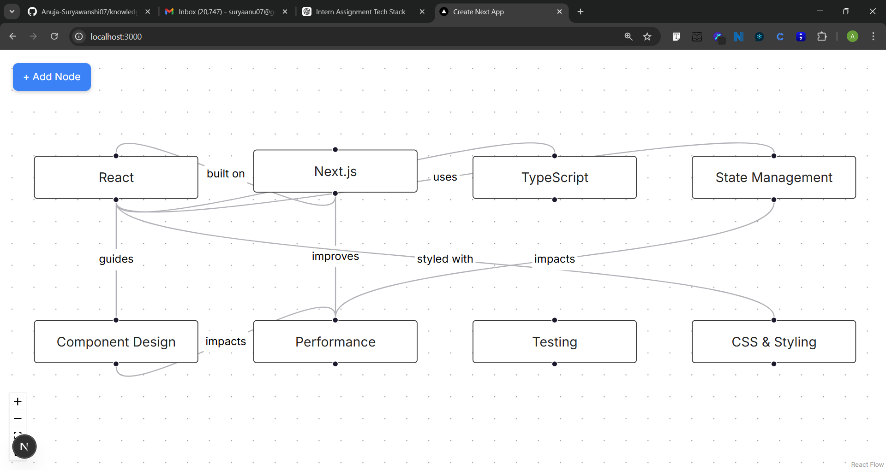

# 📚 Knowledge Graph App

An interactive **personal knowledge graph** built with **Next.js, TypeScript, and React Flow**.
This application allows users to visually map concepts and define relationships between them using an intuitive graph interface.

---

## 🚀 Features

* 🧩 Interactive graph canvas (nodes & edges)
* ➕ Create new nodes dynamically
* 🔗 Add relationships between nodes using a modal (no browser prompts)
* ✏️ Edit node title and notes via a sidebar panel
* ❌ Delete nodes and edges (keyboard support: Delete / Backspace)
* 💾 Persistent state using `localStorage`
* 🌱 Preloaded dataset using CSV seed data (first-time load)
* 🎯 Highlight directly connected nodes on selection
* 🎨 Modern UI using ShadCN UI + Radix components

---

## 🛠 Tech Stack

* **Framework:** Next.js (App Router)
* **Language:** TypeScript
* **Graph Library:** React Flow
* **UI Components:** ShadCN UI + Radix UI
* **State Management:** React Hooks
* **Persistence:** localStorage

---

## 📂 Project Structure

```
app/
  page.tsx        # Main graph implementation
components/
  ui/             # Reusable UI components (ShadCN)
```

---

## ⚙️ Getting Started

### 1. Clone the repository

```
git clone https://github.com/Anuja-Suryawanshi07/knowledge-graph-app-Next.git
cd knowledge-graph-app-Next
```

---

### 2. Install dependencies

```
npm install
```

---

### 3. Run the development server

```
npm run dev
```

---

### 4. Open in browser

```
http://localhost:3000
```

---

## 🧠 How It Works

* On the first load, the app initializes graph data using predefined CSV seed data.
* After initialization, all changes (CRUD operations) are stored in `localStorage`.
* On subsequent visits, the app restores the saved graph state automatically.

---

## 🎯 Key Implementations

* Graph rendering using React Flow
* Custom modal-based edge creation (replacing `prompt()`)
* Sidebar-based node editing (title + notes)
* Automatic removal of connected edges when deleting nodes
* Grid-based layout to prevent node overlap on initial load
* Node highlighting for better graph readability

---

## 🚀 Deployment

Deployed on Vercel

👉 Add your live link here:
`knowledge-graph-app-next.vercel.app`

---

## 📸 Screenshots
### Graph View


---

## ✨ Future Improvements

* Drag-and-drop layout persistence
* Smooth animations for node/edge transitions
* Search and filter functionality
* Import/export graph data

---

## 👩‍💻 Author

**Anuja Suryawanshi**

---

## 📄 License

This project was developed as part of an assignment/demo and is intended for learning purposes.
